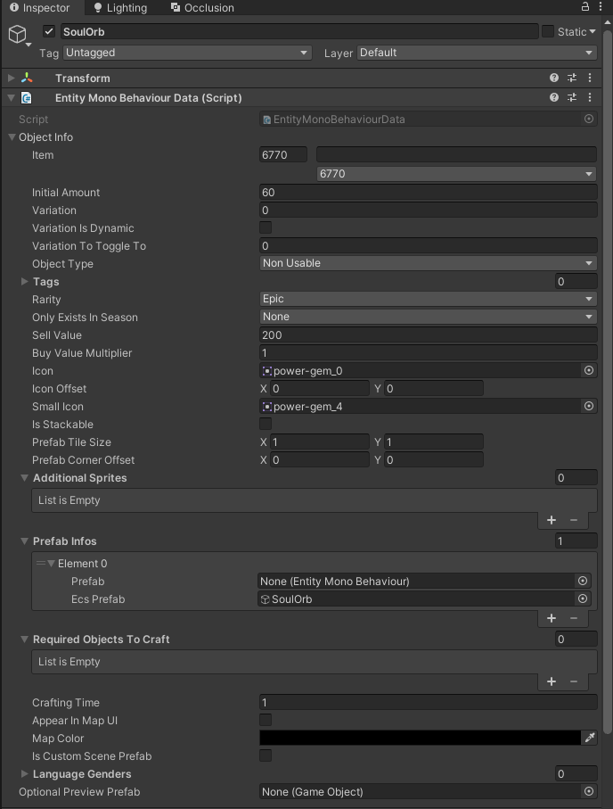
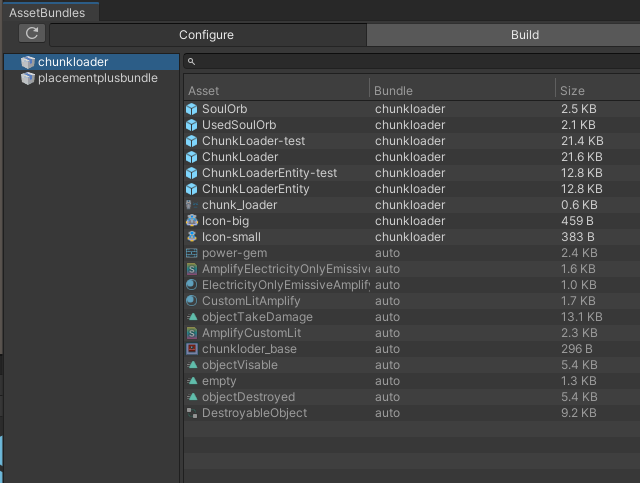
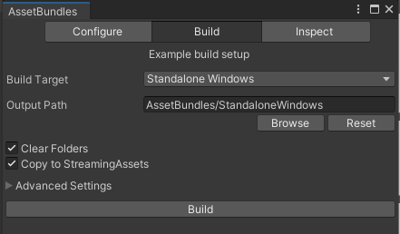

# Custom Entity Module
Custom Entity Module is a submodule that allows to add new entities. This includes items, blocks, NPCs and other things. 

## Important Note
Please note that currently this submodule <b>DOES NOT</b> support adding anything except items. This is a technical limitation that we still need to fix. 

## Usage example:
Make sure to add `[CoreLibSubmoduleDependency(nameof(CustomEntityModule))]` to your plugin attributes. This will load the submodule.

### Making Item Prefab
To actually make the item you will need a set up Unity Project. You can follow this [guide](https://github.com/CoreKeeperMods/Getting-Started/wiki/Getting-The-Assets-In-Unity).
In your Unity Project make a new prefab (Or copy one of the original ones). It should contain only the root object with `EntityMonoBehaviorData` component attached. This looks like this:


In this component you can set all kind of properties that affect what the item is. Most important properties are:

- `ObjectType` - defines what kind of entity is it. Here you can make it an armor piece or sword.
- `Icon` and `SmallIcon` - defines visual aspects of your item. Small icon is often used when you hold your item in hand. Normal icon is shown in inventory and on pedestals.
- `IsStackable` - defines if you can stack your item
- `Required Objects To Craft` allows you to define your item crafting recipe.
- `PrefabInfos` here you need to have one entry with reference to prefab itself. Note that `Prefab` field need to be empty for entity to be a item. Currently filling this field <b>IS NOT SUPPORTED</b>!

On your item prefab you can attach other ECS components which alter item behavior or properties. You can inspect vanilla items to find out what components do what.

For example here I have a `DurabilityCDAuthoring` component added. With it item will now have durability. Use this in combination with `InitialAmount` property to make item with durability.


For purposes of editing in the editor there is a Editor Kit. It adds some property drawers for some enums, allowing you to set them easily. You can find it [here](../../../EditorKit/)

Once you are done setting up your prefab place it in a folder with the name of your mod and pack a asset bundle. Don't forget to add the prefab to the bundle.

### Packing the asset bundle

This section will explain how to setup the folder structure and build the bundle. First create a folder structure where all prefabs are in a folder with the <b>keyword</b> of your mod.


Now select all prefabs you want to use and in the bottom of the inspector you should see `Asser Labels` section (It can be collapsed) and select your asset bundle. If you don't have a asset bundle click `New` and enter bundle name.


Now open asset bundle browser (Window -> AssetBundle Browser) and check your bundle. You should see all of your prefabs and their used resources.


If everything is right select `Build` section on the top and build the bundles.


Now you should see the asset bundle either in `Assets/StreamingAssets/` or the path you specified in the asset bundle browser.

### Adding item in code

With item prefab made adding it is really easy. In your plugin `Load()` method add this code:
```c#
// Get path to your plugin folder
string pluginfolder = Path.GetDirectoryName(Assembly.GetExecutingAssembly().Location);

// Create a new ResourceData class with information about the bundle
ResourceData resource = new ResourceData(MODNAME, "myamazingmod", pluginfolder);

// Load the aseet bundle and add the resource.
resource.LoadAssetBundle("myamazingmodbundle");
CustomEntityModule.AddResource(resource);

// Register your prefab. Use a UNIQUE string id to identify your item. I recommend to include your mod name in the ID.
ObjectID itemIndex = CustomEntityModule.AddEntity($"{MODNAME}:MyAmazingItem", "Assets/myamazingmod/Prefab/MyAmazingItem.prefab");

// Add localization terms for your item
Localization.AddTerm($"Items/{itemIndex}", "My Amazing Item");
Localization.AddTerm($"Items/{itemIndex}Desc", "This amazing item will change the world!");
```
Note that here `myamazingmod` is a <b>keyword</b>. This keyword is later used in the prefab path. This is important, as this is how I find which asset bundle contains the prefab. If you forget to include a keyword in your asset path it <b>WILL NOT LOAD</b>

You should cache or remember `itemIndex` variable. It contains numerical ID that the game uses to identify the item. You can cast it to `ObjectID` enum and pass to game code.
If you ever need to get this ID you can use `CustomEntityModule.GetItemIndex(string itemID)` method to access it again.

Also please note that you can't hardcode this ID. It will change depending on user mods installed. It can also be changed by user themselves by editing `CoreLib.ModItemID.cfg` config file found in `config` folder. 

## Tips on making items
If you don't know how to make a certain type of item, find it in the Unity Editor and copy the prefab. There you should see everything that makes it tick.

### Swords, Tools, Bows, etc
To make a equipable item with use animation you need to:
- Set the `ObjectType` to tool or weapon type
- Add `DurabilityCD`, `GivesConditionsWhenEquipedCD`, `CooldownCD`, `WeaponDamageCD` and `LevelCD` and configure them correctly
- Assign both icons to first sprite in item animation sheet.

Example of the sprite sheet. It should be 120x120 px and have 7 sprites showing item in different states. You can find such sheets for all weapons and tools in the Unity Editor


### Armor

To make armor you need to:
- Set the `ObjectType` to armor type
- Add `DurabilityCD`, `EquipmentSkinCD` `GivesConditionsWhenEquipedCD` and `LevelCD` and configure them correctly

Make a armor spite sheet. Examples of such sheets can be found in the Unity Editor.
Finally to add it correctly you will need some additional code:
```c#
ObjectID armor = CustomEntityModule.AddEntity("MyMod:MyAmazingArmor", "Assets/MyMod/Items/MyAmazingArmor");

CustomEntityModule.AddEntityLocalization(armor,
                "My Amazing Armor",
                "This armor is so amazing it will protect you from anything");

Texture2D armorTexture = resource.bundle.LoadAsset<Texture2D>("Assets/MyMod/Textures/myarmorsheet.png");

byte skinId = CustomEntityModule.AddPlayerCustomization(new BreastArmorSkin()
{
    breastTexture = armorTexture,
    shirtVisibility = ShirtVisibility.FullyShow
});
CustomEntityModule.SetEquipmentSkin(armor, skinId);
```
