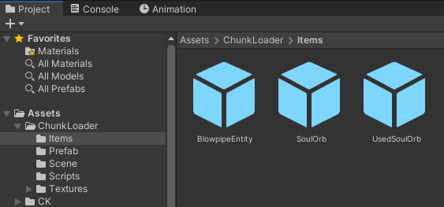

# Mod Resources Module
Mod Resources Module is a submodule that organises mod resources and facilitates loading of assets

## How to use the module:
Most of the time you don't need to declare usage directly for this module. Any dependant module will automatically request this module. To manually request loading of the module use `[CoreLibSubmoduleDependency(nameof(ResourcesModule))]` to your plugin attributes.

This guide requires the Unity Project set up. You can follow this [guide](https://core-keeper-modding.gitbook.io/modding-wiki/modding/unity-setup).

To use this module you must create an `Asset Bundle`. Asset bundles contain all mod resources, such as textures, prefabs, etc. 

### Creating asset bundle

To create an asset bundle open asset bundle browser (Window -> AssetBundle Browser) and right click in the window. Select `Add new bundle` and enter its name.  
<br>

Now create a new folder named as your `keyword`. The keywords can be anything, for example the name of your mod, but they must be UNIQUE. This folder will become root of your mod assets. Here you can make any folders and assets as you desire.

<br>
When you have created your content, you will need to add the assets to your bundle. Select all assets you want to add and in the bottom of the inspector you should see `Asser Labels` section (It can be collapsed) and select your asset bundle.

<br>
Now open asset bundle browser (Window -> AssetBundle Browser) and check your bundle. You should see all of your prefabs and their used resources.

<br>
If everything is right select `Build` section on the top and build the bundles.

<br>
Now you should see the asset bundle either in `Assets/StreamingAssets/` or the path you specified in the asset bundle browser. Make sure to copy your asset bundle into your plugin folder, next to your main assembly.

### Loading the bundle

In your plugin `Load()` method write:
```cs
// Get path to your plugin folder
string pluginfolder = Path.GetDirectoryName(Assembly.GetExecutingAssembly().Location);

// Create a new ResourceData class with information about the bundle
ResourceData resource = new ResourceData(MODNAME, "myamazingmod", pluginfolder);

// Load the aseet bundle and add the resource.
resource.LoadAssetBundle("myamazingmodbundle");
ResourcesModule.AddResource(resource);
```
Here `myamazingmod` is the keyword, replace it with your keyword. And `myamazingmodbundle` is the name of the bundle.